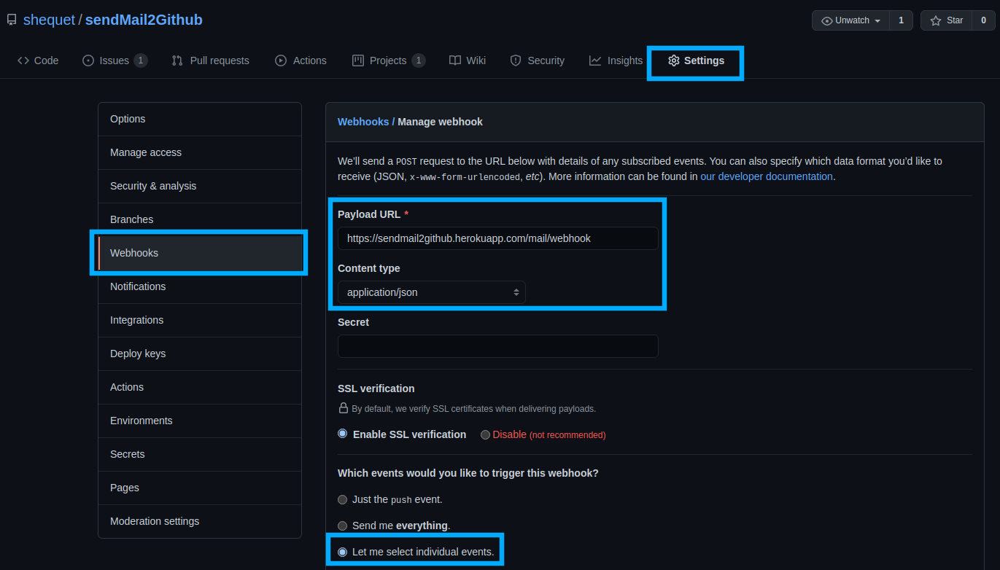
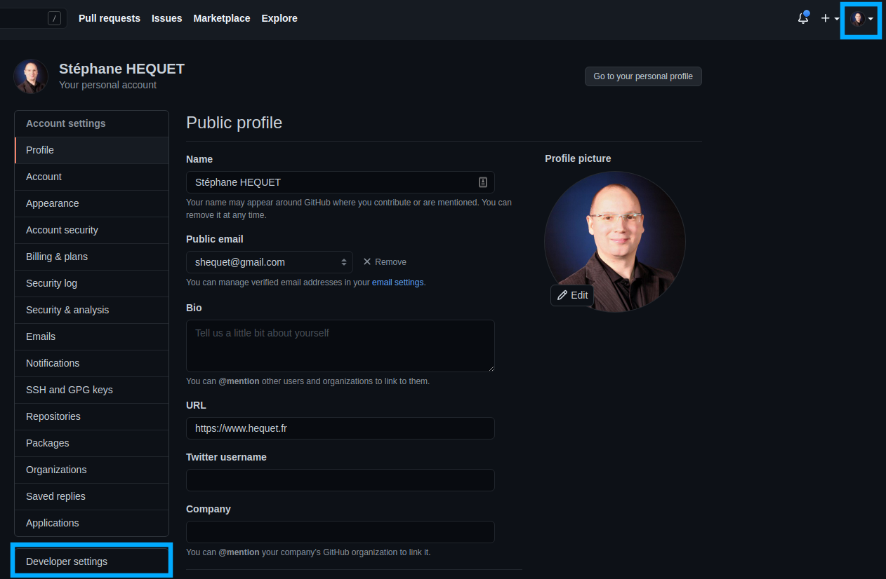
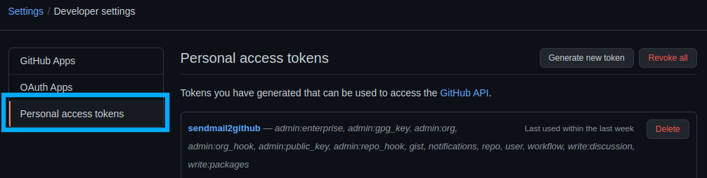
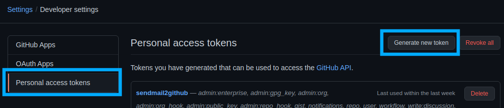

# sendMail2Github

### Installation

Après avoir créé un virtual env, installez les dépendances via le requirements.txt

```shell
pip install -r requirements.txt
```

### Configurer les variables d'environnement

| Nom  | Exemple  | Description  |
|---|---|---|
| DJANGO_SECRET_KEY |   | Clé secrète pour Django  |
| GITHUB_TOKEN | ghpxxxx  | Nom du token GitHub  |
| GITHUB_REP | shequet/sendMail2Github  | Nom complet du repo Github  |
| SENTRY_URL  |   |  URL de Sentry |
| IMAP_HOST  |   |  Nom ou IP du serveur Imap |
| IMAP_PORT  |   |  Numéro du port Imap |
| IMAP_TLS  |   | Activer ou non le TLS (0, 1)  |
| IMAP_USER  |   | Nom de l'utilisateur Imap  |
| IMAP_PASSWORD  |   | Mot de passe de l'utilisateur Imap  |
| SMTP_HOST  |   |  Nom ou IP du serveur SMTP |
| SMTP_PORT  |   |  Numéro du port SMTP |
| SMTP_TLS  |   | Activer ou non le TLS (0, 1)  |
| SMTP_USER  |   | Nom de l'utilisateur SMTP  |
| SMTP_PASSWORD  |   | Mot de passe de l'utilisateur SMTP  |
| SMTP_FROM  |   | Adresse Mail de l'expéditeur  |

### Configurer un Webhook sur le repo Github

### Indiquer l'url du serveur Django



### Créer un API Key sur Github






### Démarrer le serveur Web Dajngo en mode développeur
```shell
python manage.py runserver
```

### Lancer les tests

Adapater l'exclusion de l'environnement virtuel  ``'venv/*'``
```shell
coverage report --omit 'venv/*' manage.py test
```

### Valider la couverture des tests

Adapater l'exclusion de l'environnement virtuel  ``'venv/*'``
```shell
coverage report --omit 'venv/*'
```

### Démo en ligne sur herokuapp

https://sendmail2github.herokuapp.com/

### Accueil


### Connexion


### Ticket : en cours


### Ticket : terminé


### Ticket : ajouter un commentaire


Le ticket côté GitHub :


### Admin : utilisateurs


### Admin : ajouter un utilisateur


### Admin : modifier un utilisateur

