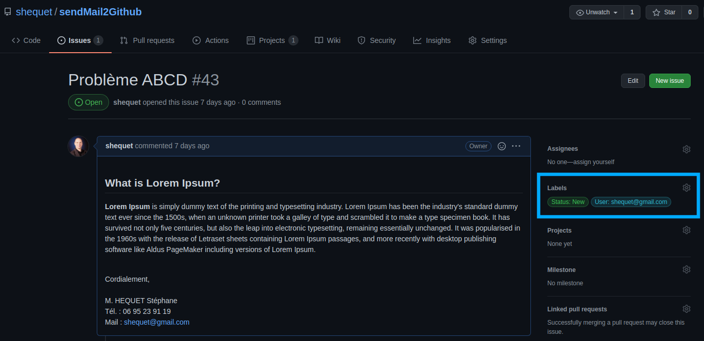

# sendMail2Github

### Installation

Après avoir créé un virtual env, installez les dépendances via le requirements.txt

```shell
pip install -r requirements.txt
```

### Démarrer le serveur Web Dajngo en mode développeur
```shell
python manage.py runserver
```

### Lancer les tests

Adapater l'exclusion de l'environnement virtuel  ``'venv/*'``
```shell
coverage report --omit 'venv/*' manage.py test
```

### Valider la couverture des tests

Adapater l'exclusion de l'environnement virtuel  ``'venv/*'``
```shell
coverage report --omit 'venv/*'
```

### Démo en ligne sur herokuapp

https://sendmail2github.herokuapp.com/

### Accueil


### Connexion


### Ticket : en cours


### Ticket : terminé


### Ticket : ajouter un commentaire


Le ticket côté GitHub :


### Admin : utilisateurs


### Admin : ajouter un utilisateur


### Admin : modifier un utilisateur

